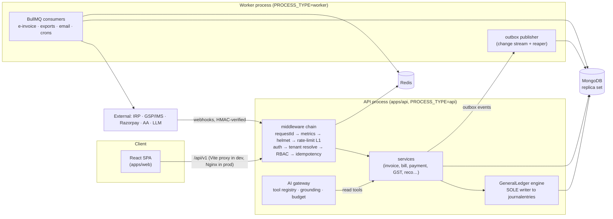

# FinPilot AI

**Cloud accounting for Indian SMEs, with an AI copilot that narrates numbers the
engine computes — it never computes them itself.**

An Indian SME owner spends three days a month on GST reconciliation and still
can't answer _"how much cash will I have in two weeks."_ FinPilot automates the
first and answers the second — with a correctness guarantee.

- 📚 **[GUIDE.md](GUIDE.md)** — end-to-end user guide (start here to use the app)
- 📐 **[plan.md](plan.md)** — the full build specification (single source of truth)
- ⚖️ **[CLAUDE.md](CLAUDE.md)** — the ten non-negotiable invariants
- 🧭 **[docs/runbooks/](docs/runbooks/)** — operations: alerts, restore drill, launch checklist

---

## What it does

| Area            | Features                                                                                                                                                                                                                                                |
| --------------- | ------------------------------------------------------------------------------------------------------------------------------------------------------------------------------------------------------------------------------------------------------- |
| **Core ledger** | 60-account Indian SME chart (Schedule III), double-entry engine, gapless document numbering, trial balance, append-only postings with reversing corrections                                                                                             |
| **Sales**       | GST-compliant invoicing (server-computed CGST/SGST/IGST), e-invoice IRN via IRP, email delivery, cancel-by-reversal                                                                                                                                     |
| **Purchases**   | Vendor bills and expenses with approval workflow (no self-approval), ITC posting, **OCR: photograph a bill → confident fields → human-confirmed draft**                                                                                                 |
| **Money**       | Payments in/out with multi-invoice allocation, advances with GST, Razorpay webhook settlement, bank CSV import with fingerprint dedupe, scored reconciliation suggestions with human confirm                                                            |
| **Compliance**  | GSTR-1 / GSTR-3B preparation with journal-entry traceability, **IMS reconciliation** (sync → auto-match → accept/reject/pending with push-back), GSTIN checksum validation, GST 2.0 rate history                                                        |
| **Reports**     | TB, P&L, balance sheet, cash flow, AR/AP aging — any as-of date, queued CSV exports                                                                                                                                                                     |
| **AI copilot**  | Natural-language questions over your books via ~24 read tools, numeric grounding validation (I9), write **proposals** a human confirms (I10), fail-closed token budget                                                                                  |
| **Forecast**    | Deterministic 13-week Monte Carlo cash forecast (P10/P50/P90), explainable health score, anomaly rules (duplicates, Benford, vendor bank-detail changes)                                                                                                |
| **Platform**    | Multi-company orgs (CA-firm ready), RBAC with permission strings, 2FA, refresh-token rotation with reuse detection, notifications (in-app/email/WhatsApp), subscriptions with usage metering + Razorpay, super-admin console with audited impersonation |

## Tech stack

| Layer          | Choice                                          | Why                                                              |
| -------------- | ----------------------------------------------- | ---------------------------------------------------------------- |
| Runtime        | **Node.js 22 + TypeScript** (strict)            | one language across the stack                                    |
| API            | **Express 5**                                   | boring, battle-tested                                            |
| Database       | **MongoDB 7 replica set** (Mongoose 8)          | transactions + change streams need the replica set — even in dev |
| Cache / queues | **Redis 7** + **BullMQ**                        | rate limiting (Lua), background jobs, DLQ with replay            |
| Frontend       | **React 19 + Vite 6**                           | SPA; zero chart/router deps — hash router + inline-SVG charts    |
| AI             | Provider-abstracted gateway (Groq/Gemini-ready) | scriptable stub in tests; the model is replaceable               |
| Payments       | **Razorpay** (payments + subscriptions)         | Stripe is not self-serve in India                                |
| Files          | MinIO (S3-compatible)                           | document/OCR storage                                             |
| Email          | Nodemailer → Mailhog (dev)                      | every mail visible at :8025                                      |
| Observability  | prom-client → Prometheus/Grafana, Sentry, pino  | RED + domain metrics, alert rules in `ops/`                      |
| Monorepo       | **pnpm workspaces + Turborepo**                 | shared contract package, cached tasks                            |

## Architecture



**The flow that matters** — issuing an invoice: the client sends qty/rate only →
the server recomputes every total (I5) → one MongoDB transaction consumes the
next gapless number from `counters` (I6), writes the invoice, posts a balanced
journal entry through the GeneralLedger (I2/I3), writes the audit row and an
outbox event → the worker picks the outbox event and queues IRN generation.
If anything fails, the transaction aborts and the number is never consumed.

### Monorepo layout

```text
packages/shared     the contract — Zod schemas, money helpers (integer paise),
                    GSTIN checksum, GST rate history, permissions, plan limits
packages/presets    shared tsconfig / eslint / prettier
apps/api            Express API + worker (PROCESS_TYPE selects entrypoint)
  src/engines       GeneralLedger (sole ledger writer), GstEngine, forecast
  src/services      document flows; services/admin = cross-tenant (metering, console)
  src/plugins       tenantScope — companyId injected into EVERY query (I8)
  src/ai            gateway, tool registry, grounding validator, budget
  src/queues        BullMQ definitions, workers, outbox
  tests/integration 26 spec files — every §32 acceptance criterion
apps/web            React SPA — feature-sliced pages over a tiny shared UI kit,
                    light/dark themes on CSS variables, inline-SVG charts
ops/                prometheus.yml + alerts.yml, Grafana dashboard, nginx conf
scripts/            k6 load tests, restore drill
docs/runbooks/      on-call alerts, DLQ replay, breach response, launch checklist
```

### The ten invariants (the constitution — [CLAUDE.md](CLAUDE.md))

1. **Money is integer paise.** No floats, no Decimal128. `formatINR` runs once, at the React boundary.
2. **Every journal entry balances** — schema hook + in-transaction assert + nightly job.
3. **GeneralLedger is the sole writer** to `journalentries` (CI greps imports to enforce it).
4. **Postings are append-only.** Corrections are reversing entries; there is no PATCH.
5. **Server-authoritative amounts.** Client totals are discarded, never validated against.
6. **Gapless numbering** from `counters` inside the same transaction (GST law).
7. **Idempotency everywhere** — `Idempotency-Key` on every mutation; replays return the stored response.
8. **Tenant isolation at the query layer** — an AsyncLocalStorage plugin injects `companyId` into every query; a query without context throws.
9. **The AI never asserts a number it did not retrieve** — answers are post-validated against tool results, fail-closed.
10. **Nothing irreversible without a human confirm** — AI writes are proposals until a person clicks Confirm.

## Quick start

Prerequisites: Node ≥ 22, pnpm ≥ 10, Docker Desktop.

```bash
pnpm install
pnpm setup:env          # .env.local with generated secrets
docker compose up -d    # Mongo replica set (auto rs.initiate), Redis, MinIO, Mailhog
pnpm dev                # api :4000 + worker + web :5173
```

Verify: `curl localhost:4000/healthz` → 200 · `curl localhost:4000/readyz` →
`{"ready":true}` · Mailhog UI :8025. Then follow **[GUIDE.md](GUIDE.md)**.

Optional observability stack: `docker compose -f docker-compose.observability.yml up -d`
(Prometheus :9090, Grafana :3001).

## Scripts

| Command                             | What it does                                                          |
| ----------------------------------- | --------------------------------------------------------------------- |
| `pnpm dev`                          | api + worker + web, watch mode                                        |
| `pnpm test`                         | Vitest across workspaces (integration tests use the real replica set) |
| `pnpm lint` / `pnpm typecheck`      | ESLint / strict tsc across workspaces                                 |
| `pnpm format`                       | Prettier write                                                        |
| `bash scripts/ops/restore-drill.sh` | dump → restore → verify the database (the §31 drill)                  |
| `k6 run scripts/load/k6-api.js`     | §29.4 load targets as pass/fail thresholds (staging)                  |

## Testing

~190 tests across 26 integration spec files plus shared unit tests. The gate
that matters most: **`ledger.spec.ts`** — 100 concurrent postings produce 100
gapless numbers (run 50×), an aborted transaction consumes nothing, and after
10,000 randomized postings the ledger still balances to the paise. CI also
greps the codebase for invariant violations (tenant-scope escapes, foreign
writers to the ledger) and runs gitleaks + audit.

## Security highlights

argon2id passwords with timing-equalized failures · refresh rotation with
family reuse detection · TOTP 2FA with encrypted secrets · access tokens in
memory only (never localStorage) · HMAC-verified webhooks with replay dedupe ·
strict CSP without `unsafe-inline`, HSTS preload · pino redaction of the
never-log list · rate limiting in five layers (fail-open reads, fail-closed
auth) · append-only audit trail (7-year TTL) with impersonation tagging.

## Build history

Built phase-by-phase against [plan.md](plan.md) §32 — each phase merged only
when its acceptance criteria passed as tests.

| Phase | Scope                                                               | Status |
| ----- | ------------------------------------------------------------------- | ------ |
| 0     | Repo and rails (monorepo, docker infra, env validation)             | ✅     |
| 1     | Error, response, request rails (envelope, AppError, requestId)      | ✅     |
| 2     | Auth (argon2id, refresh rotation + reuse detection, 2FA, lockout)   | ✅     |
| 3     | Tenancy and RBAC (tenant plugin, roles, invites, perm cache)        | ✅     |
| 4     | Chart of accounts (60-account Indian SME COA, tree UI)              | ✅     |
| 5     | General Ledger engine (post/reverse/TB, gapless numbers, I2–I4)     | ✅     |
| 6     | Parties and items (GSTIN checksum, GST 2.0 rate history, imports)   | ✅     |
| 7     | Invoicing (I5 totals, §12.2 GL posting, idempotency I7)             | ✅     |
| 8     | Bills, expenses, approvals (ITC posting, no self-approval)          | ✅     |
| 9     | Payments and allocation (advances + GST, Razorpay webhook)          | ✅     |
| 10    | Rate limiting (§19 layers, Lua, fail-open/closed, breakers)         | ✅     |
| 11    | Queues (BullMQ, outbox publisher, DLQ + replay, cron)               | ✅     |
| 12    | GST returns (GSTR-1/3B, journal-entry trace, TB reconciliation)     | ✅     |
| 13    | E-invoicing (async IRN, INV-01, 4xx/5xx semantics, 24h cancel)      | ✅     |
| 14    | IMS (sync + bill matcher, push-back, pending cap, ITC alarm)        | ✅     |
| 15    | Banking (CSV import + fingerprint dedupe, AA sandbox flow)          | ✅     |
| 16    | Reconciliation (scoring engine, human confirm, from-line entry)     | ✅     |
| 17    | Reports (TB/P&L/BS/cash flow/aged, queued CSV exports)              | ✅     |
| 18    | Documents/OCR (₹0 text layer, confidence contract, bill-from-doc)   | ✅     |
| 19    | AI Copilot (read tools, grounding I9, fail-closed budget, SSE)      | ✅     |
| 20    | Write tools + proposals (I10 confirm, TTL, preview ignored)         | ✅     |
| 21    | Forecast/health/anomalies (deterministic P10/50/90, drivers)        | ✅     |
| 22    | Notifications (idempotent, preferences, overdue + GST reminders)    | ✅     |
| 23    | Subscriptions and admin (402 + upgrade path, audited impersonation) | ✅     |
| 24    | Observability, security, launch (metrics, alerts, drill, runbooks)  | ✅     |

Plus the full web UI: light/dark themed SPA with dashboard charts, OCR upload,
IMS actions, copilot chat, and the admin console.
