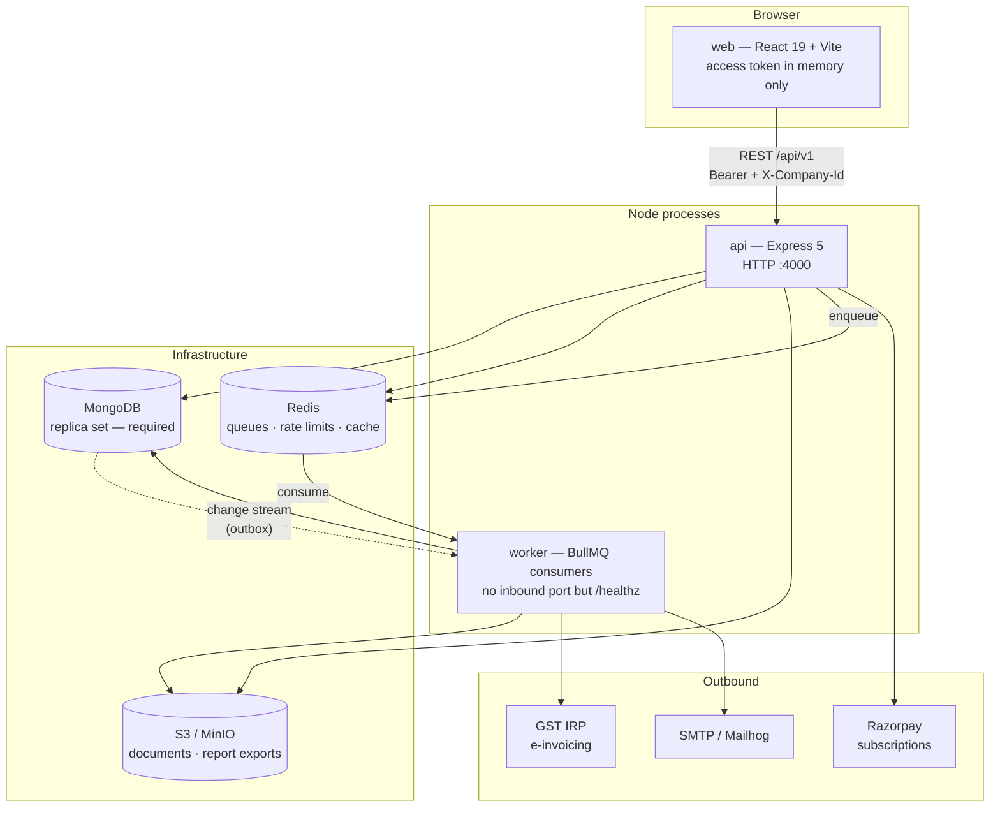
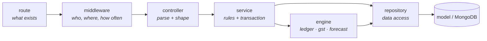
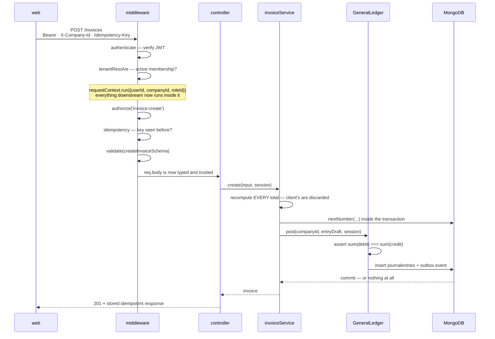
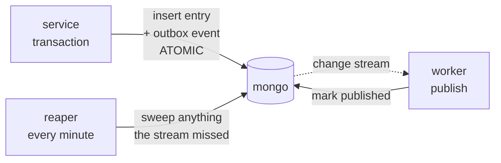
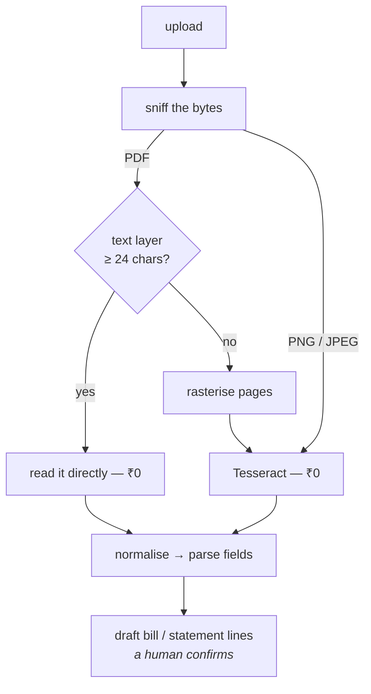

# FinPilot — architecture

What the system is made of, how a request travels through it, and where each
rule is actually enforced.

This is the engineering view. For what the product _does_ — which screen is for
what, and a sale traced end to end with real numbers — read
[how-it-works.md](./how-it-works.md). The two are meant to be read together:
that one is the flow a user sees, this one is the machinery under it.

---

## The shape, in one paragraph

FinPilot is a double-entry accounting system for Indian SMEs. Three processes
(**api**, **worker**, **web**) sit on three pieces of infrastructure
(**MongoDB as a replica set**, **Redis**, **S3/MinIO**). Everything a user does
turns into a _journal entry_, and exactly one module is allowed to write those.
The interesting part of the design is not the feature list — it is that ten
invariants (`CLAUDE.md` §3) are each pinned to a specific enforcement point in
the code, so violating one is a build error or a thrown exception rather than a
code-review opinion.

---

## 1. Processes and infrastructure



**Why the replica set is not optional.** Every posting is a multi-document
transaction, and the outbox publisher tails a change stream. Both are replica-set
features. A standalone `mongod` does not merely run slower — `GeneralLedger.post`
cannot commit at all. `rs.initiate()` is part of bringing the stack up.

**Why `api` and `worker` are separate processes.** Anything slow or failable —
e-invoice submission to the IRP, report exports, email — runs where a retry
storm cannot take the request path down with it. The worker owns no HTTP surface
beyond a health probe.

---

## 2. Repository layout

A pnpm workspace driven by Turborepo.

```text
apps/
  api/          Express API + the worker entrypoint   (149 .ts files, 31 specs)
    src/
      routes/v1/     18 routers — the HTTP surface
      controllers/   parse the request, call one service, shape the response
      services/      business rules; the only place a transaction is opened
      repositories/  data access; no business logic
      models/        33 Mongoose schemas
      engines/       ledger · gst · forecast  ← the three things worth calling engines
      queues/        BullMQ definitions, producers, workers
      jobs/          what each cron tick actually does
      ai/            gateway · registry · guardrails · budget
      ocr/           the document-extraction cascade
      plugins/       tenantScope — the tenancy enforcement point
      middleware/    the 10-step request chain
  web/          React 19 + Vite  (29 source files, feature-foldered)
packages/
  shared/       Zod schemas + constants, imported by BOTH api and web
```

`packages/shared` is what keeps the two halves honest: the same Zod schema that
validates an invoice on the server types the form on the client, so a field
cannot drift between them.

---

## 3. The layer cake

Every request crosses the same six layers, in the same direction, and layers
never skip.



The rules that make it worth having:

- A **controller** never opens a transaction and never contains a business rule.
- A **service** is the only thing that opens a `ClientSession`. Every write method
  takes one, so several services can be composed into a single atomic posting.
- A **repository** holds no business logic — it is the seam that keeps Mongoose
  out of the services.
- An **engine** is a rule-set with no HTTP awareness. There are exactly three.

---

## 4. A request, traced

The per-route chain, in the order `plan.md` §5.3 fixes:

```text
requestId → httpLogger → metrics → helmet → cors → json(256kb) → cookies → globalRateLimit
    └─ per route: authenticate → tenantResolve → userRateLimit → authorize → idempotency → validate → controller
```

`POST /api/v1/invoices`, all the way down:



The line that matters most is the `requestContext.run(...)`. After it, no query
in the request can escape the tenant — see next section.

---

## 5. Where each invariant actually lives

The ten rules from `CLAUDE.md` are not aspirations; each has an address.

| #   | Invariant                         | Enforced at                               | How                                                                                                                                                    |
| --- | --------------------------------- | ----------------------------------------- | ------------------------------------------------------------------------------------------------------------------------------------------------------ |
| I1  | Money is integer paise            | `packages/shared` schemas                 | Every money field name ends `Paise`. ⚠️ **Convention only today** — see the gap noted below                                                            |
| I2  | Every entry balances              | `engines/ledger/GeneralLedger.ts`         | `pre('validate')` hook **and** re-asserted in-transaction **and** a nightly job — three layers, because one will eventually be bypassed                |
| I3  | Sole writer to `journalentries`   | `GeneralLedger` + a CI gate               | Only 6 services call `post`/`reverse`: invoice, bill, expense, payment, journal, reconciliation. CI greps for any other writer and fails the build     |
| I4  | Postings are append-only          | `models/JournalEntry.ts`                  | No `PATCH` route exists; corrections are reversing entries via `reversesEntryId`                                                                       |
| I5  | Server-authoritative totals       | each service                              | Client totals are discarded, never validated against                                                                                                   |
| I6  | Gapless document numbers          | `models/Counter.ts`                       | `findByIdAndUpdate({$inc}, {session})` — **the session is the whole point**: an aborted transaction does not consume a number                          |
| I7  | Idempotent mutations              | `middleware/idempotency.ts`               | Key + request hash + response stored 24h; replay returns the stored response, a _different_ body under the same key is `422`                           |
| I8  | Tenant isolation                  | `plugins/tenantScope.ts`                  | A Mongoose plugin injects `companyId` into every find/update/delete/aggregate from `AsyncLocalStorage`. **A query with no resolved companyId throws.** |
| I9  | AI asserts only retrieved numbers | `ai/guardrails.ts`                        | Every numeral in an answer must appear in a tool result from the same turn; fail closed                                                                |
| I10 | AI proposes, humans confirm       | `ai/registry.ts` + `models/AiProposal.ts` | Write-class tools return a proposal; only a human click executes it                                                                                    |

**I8 is the one to understand properly**, because it is the difference between
tenancy that holds and tenancy that leaks. It is enforced at the _query_ layer,
not the controller layer:

```js
schema.pre(GUARDED, function () {
  const ctx = requestContext.getStore();
  if (!ctx?.companyId) throw new AppError('TENANT_CONTEXT_MISSING', 500);
  this.where({ companyId: ctx.companyId });
});
```

There is no code path where forgetting a `.where({companyId})` leaks data — the
default is to throw. The escape hatch, `skipTenantScope`, is deliberately
greppable, and CI fails the build if it appears outside `migrations/`, `jobs/`
and `services/admin/`. For aggregations the `$match` is forced to **stage 0**,
since a `$lookup` ahead of it would read the whole collection first.

### The gates in CI

`.github/workflows/ci.yml` runs three jobs — `lint`, `test`, `security` — and
the `lint` job carries two greps that are really invariant checks:

- **`skipTenantScope` gate** (I8) — the escape hatch outside its three allowed
  directories fails the build.
- **`journalentries` sole-writer gate** (I3) — anything but `GeneralLedger`
  writing that collection fails the build.

> ⚠️ **Known gap — I1 is not machine-enforced.** `CLAUDE.md` states that a lint
> rule enforces the `Paise` suffix on money fields. That rule does not exist yet:
> `packages/presets/eslint/index.mjs` still reads _"Later phases add the custom
> rule that enforces the `Paise` suffix on money fields (I1)."_ Until it lands,
> I1 rests on convention and review, unlike I3 and I8 which fail the build. Worth
> knowing before trusting the invariant table as uniformly automatic.

---

## 6. The three engines

| Engine             | File                              | Responsibility                                                                                                                                                  |
| ------------------ | --------------------------------- | --------------------------------------------------------------------------------------------------------------------------------------------------------------- |
| **General Ledger** | `engines/ledger/GeneralLedger.ts` | `post`, `reverse`, `trialBalance`, `accountLedger`. Four methods; that is the entire engine. Every financial fact in the product is derived from what it wrote. |
| **GST**            | `engines/gst/GstEngine.ts`        | CGST/SGST vs IGST by state code, GSTR-1 (b2b/b2cs), GSTR-3B (3.1a, 4A), IMS reconciliation                                                                      |
| **Forecast**       | `engines/forecast/index.ts`       | Cash-position projection from receivables and payables                                                                                                          |

The ledger engine knows nothing about invoices. The invoice module does not know
how to debit a receivable — it describes the entry it wants and asks the ledger
to post it. That asymmetry is what makes a new document type cheap to add.

---

## 7. Data model

33 collections. Grouped by what they are for:

- **Tenancy & identity** — `Organization`, `Company`, `User`, `Membership`, `Role`, `Session`, `VerificationToken`
- **The books** — `Account` (chart of accounts), `JournalEntry` (append-only), `Counter`
- **Documents** — `Invoice`, `Bill`, `Expense`, `Payment`, `Party`, `Item`, `Document`
- **Banking** — `BankAccount`, `BankTransaction`, `Reconciliation`
- **Compliance** — `GstReturn`, `ImsRecord`
- **Platform** — `Subscription`, `Notification`, `ReportJob`, `AuditLog`, `AdminAudit`, `ImpersonationSession`
- **Plumbing** — `IdempotencyKey`, `OutboxEvent`, `DeadLetter`
- **AI** — `AiConversation`, `AiProposal`

`companyId` is the **first key of every compound index** on a tenant-scoped
model. Not a detail: it is what makes the forced `$match` cheap instead of a
collection scan.

---

## 8. Asynchronous work

Nine queues, not one queue with a `type` field — a stuck job in one must never
block another. Every payload has a Zod schema, so a malformed job is never
enqueued.

| Queue                      | Concurrency | Attempts | Schedule     |
| -------------------------- | ----------- | -------- | ------------ |
| `email`                    | 20          | 5        | on demand    |
| `einvoice.generate`        | 5           | 6        | on demand    |
| `report.export`            | 2           | 2        | on demand    |
| `cron.outbox.reaper`       | 1           | 1        | every minute |
| `cron.invoice.overdue`     | 1           | 1        | 06:00 daily  |
| `cron.einvoice.deadline`   | 1           | 1        | 08:00 daily  |
| `cron.ledger.integrity`    | 1           | 1        | 02:15 daily  |
| `cron.idempotency.sweep`   | 1           | 1        | 04:00 daily  |
| `cron.subscription.rollup` | 1           | 1        | 01:00 daily  |

### The transactional outbox

Posting a journal entry and telling the outside world about it must not be able
to disagree. So the event is written **inside the same transaction** as the
posting, and published afterwards:



The change stream gives low latency; the every-minute reaper is the _guarantee_
when a resume token is lost. Neither alone is enough.

`cron.ledger.integrity` is the nightly re-proof of I2 across every entry — the
third of the three layers, and the one that catches a bypass of the other two.

---

## 9. The AI subsystem

```text
assertBudget → ≤6 tool iterations → grounding validation → one corrective retry → raw-table fallback
```

Four properties hold this together:

1. **Budget first.** Spend is checked before a token is bought, not after.
2. **Tool results are data, never instructions.** The provider only ever sees the
   filtered tool list; `executeTool` re-scopes every call to the caller's tenant,
   so the AI inherits I8 rather than working around it.
3. **Grounding is validated, and fails closed.** Every numeral in the answer must
   appear in a tool result from the same turn. Invalid → retry once with a
   corrective message → fall back to rendering the raw table. The user never sees
   a confident invented figure.
4. **Writes are proposals.** A write-class tool returns a `proposal`; the UI
   renders a diff; a human clicks Confirm. There is no path where the model posts.

Providers (Groq, Gemini) register behind an interface. Tests use a scriptable
stub — never a real LLM.

---

## 10. Document extraction (OCR)

Cost-ordered, and it fails closed:



Capped at `OCR_MAX_PAGES` (default 5) so a 200-page statement cannot hold a
request open. **An unreadable document yields empty text**, which the parser
turns into nulls and the UI renders as _"not read — fill by hand"_. That is the
safe outcome; a fabricated total is not. The paid vision tier slots in below
Tesseract without changing the shape.

---

## 11. The web app

React 19 + Vite, foldered by feature rather than by file type:

```text
features/  dashboard · sales · purchases · money · parties · ledger · accounts
           journal · compliance · reports · documents · copilot · platform · landing
lib/       api.ts · ui.tsx · toast.tsx · errors.ts · ErrorBoundary.tsx
```

Two decisions carry most of the weight:

- **The access token lives in memory only** — never `localStorage`. The refresh
  token is an httpOnly cookie the browser handles. An XSS bug cannot exfiltrate
  a session.
- **`lib/api.ts` is the only thing that talks to the server.** It attaches the
  bearer token, `X-Company-Id` and a fresh `Idempotency-Key` on every mutation,
  and funnels failures into typed toasts — so error handling is a property of
  the client, not something each page re-implements.

Money is formatted exactly once, at the React boundary, via `formatINR(paise)`.

---

## 12. Testing

28 integration spec files (plus 3 unit), run against `mongodb-memory-server`
**as a replica set** — the same transactional guarantees as production, so a test cannot pass
on semantics production does not have.

The suite is structured around proving invariants rather than exercising
endpoints: there is a tenancy spec that iterates `tenantScopedModels` and asserts
every one of them is scoped, a ledger-integrity spec, an idempotency spec, and a
`security` gate in CI.

> Run the suite with the dev worker **stopped**. Both consume the same Redis
> queues, and a running dev worker will steal jobs from the tests — it surfaces
> as `REPORT_JOB_NOT_FOUND` failures that look like regressions and are not.

---

## 13. Where to change what

| To add…                         | Touch                                                                                                              |
| ------------------------------- | ------------------------------------------------------------------------------------------------------------------ |
| a field on an existing document | `packages/shared/src/schemas/*` → model → service → the feature folder in web                                      |
| a new document type that posts  | model → repository → service (build the entry draft, call `GeneralLedger.post`) → controller → route → web feature |
| a new report                    | `services/reportService.ts` → `routes/v1/report.routes.ts`; if it is slow, the `report.export` queue               |
| a background job                | `queues/definitions.ts` (queue + Zod payload + policy) → `jobs/*` → register in `queues/workers`                   |
| a new AI capability             | `ai/registry.ts` — and if it writes, it returns a proposal                                                         |
| a GST rule                      | `engines/gst/GstEngine.ts`, with a case in `docs/dummy/gst-checks.md` a CA can verify by hand                      |

Whatever the change: if it moves money, it ends in a balanced journal entry
posted by `GeneralLedger`, inside a transaction, numbered from a counter in that
same transaction. There is no second way to do it, and that is the point.
