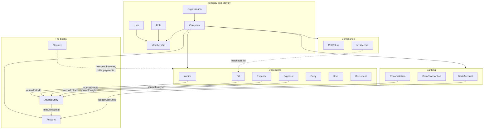
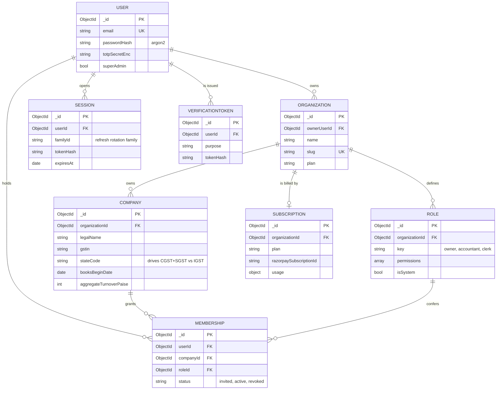
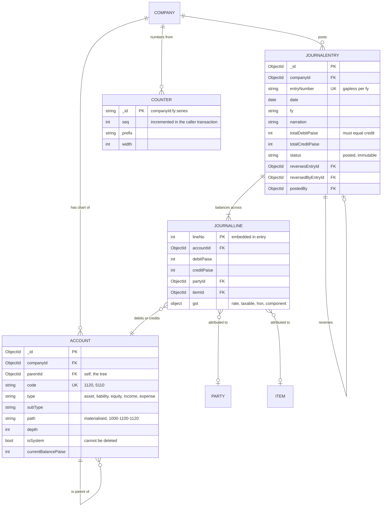
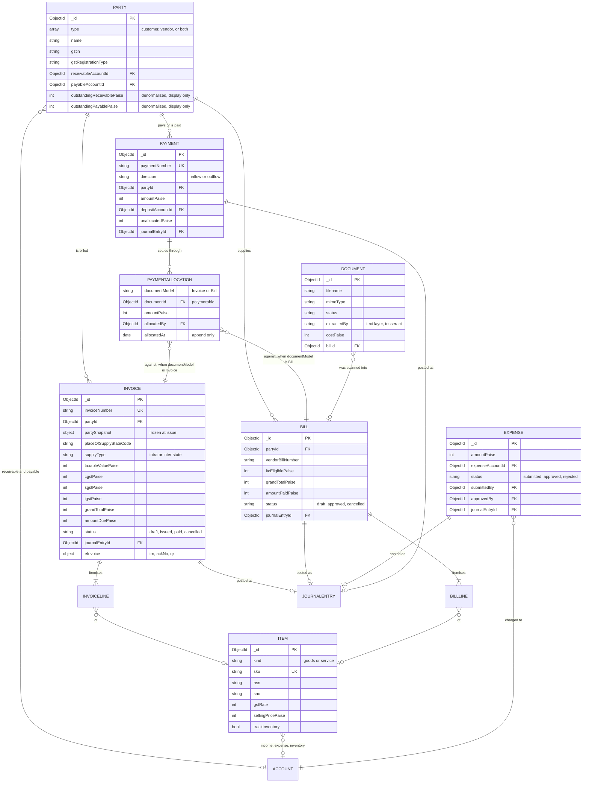
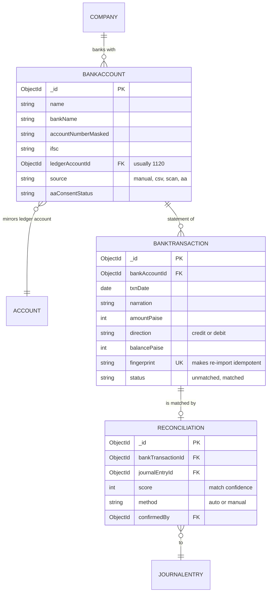
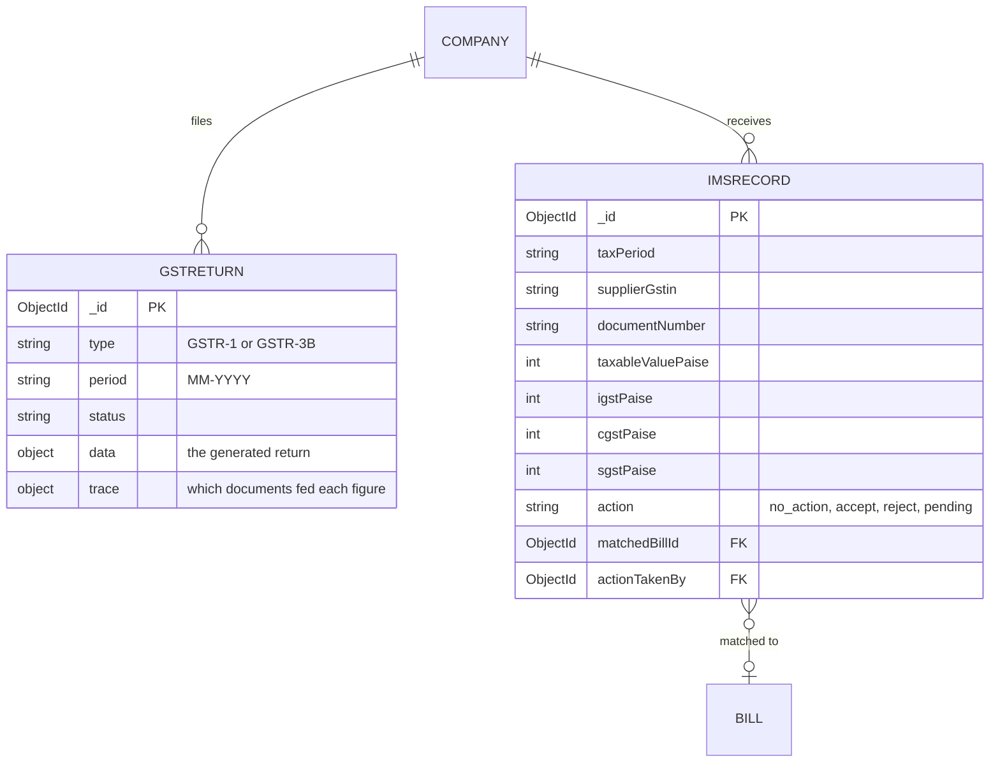
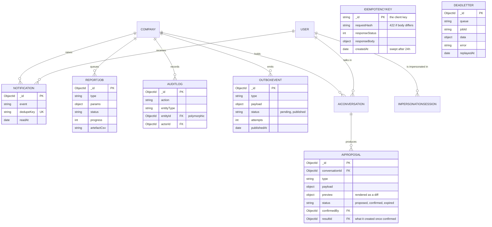

# FinPilot — entity relationship diagram

The 33 collections, their keys, and how they reference one another.

Extracted from the Mongoose schemas in `apps/api/src/models`, so this is what
the code actually declares rather than a design sketch. For the runtime picture
— processes, layers, queues — read [architecture.md](./architecture.md); for
what each screen does, [how-it-works.md](./how-it-works.md).

---

## Two rules shape the whole schema

**Everything tenant-scoped carries `companyId`, and it is the first key of every
compound index.** It is omitted from the per-domain diagrams below only to keep
them readable — assume it on every entity except the seven listed as
organization- or user-scoped (`Organization`, `User`, `Role`, `Membership`,
`Session`, `VerificationToken`, `Subscription`) and the four global ones
(`IdempotencyKey`, `DeadLetter`, `AdminAudit`, `ImpersonationSession`).

**Every money-moving document points at exactly one `JournalEntry`.** Invoice,
Bill, Expense, Payment and Reconciliation each hold a `journalEntryId`. That
field is the seam between the document world and the books: the document records
_what was agreed_, the journal entry records _what it did to the accounts_.

---

## The map

Read it as: a company owns a chart of accounts and a pile of documents; every
document that moves money resolves to a journal entry; every journal line lands
on an account.

---

## 1. Tenancy and identity

`MEMBERSHIP` is the join that makes tenancy work: a user reaches a company only
through an active membership, and `tenantResolve` checks it on every request
before any query runs.

---

## 2. The books

Three things this diagram encodes that matter:

- **`JOURNALLINE` is embedded, not a collection.** An entry and its lines are one
  document, so the balance rule is enforced by a single schema hook and a posting
  can never half-commit.
- **`ACCOUNT.parentId` plus `path`** is a materialised-path tree. Reparenting
  rewrites the whole subtree's `path`, which is why there is a cycle check.
- **`reversesEntryId` / `reversedByEntryId`** are how corrections work. There is
  no update path on a posted entry.

`JOURNALENTRY.source` also carries a polymorphic `{ type, documentId,
documentModel }` pointing back at whatever caused the posting — one of `manual`,
`invoice`, `bill`, `payment`, `expense`, `bank`, `opening_balance`, `reversal`,
`depreciation`, `fx`, `closing`, `ai_proposed`.

---

## 3. Sales, purchases and parties

**`PAYMENTALLOCATION` is the one polymorphic reference in the schema.** An
allocation points at an Invoice or a Bill depending on `documentModel`, which is
why the index is on `allocations.documentId` rather than a typed FK. Allocations
are append-only — an over-allocation is blocked by the rule
`sum(allocations) + refunded <= amountPaise`.

`partySnapshot` is deliberate denormalisation: a later edit to a party must never
change an invoice that was already issued.

---

## 4. Banking and reconciliation

`fingerprint` is what makes importing the same statement twice harmless — the
duplicate rows are recognised and skipped rather than doubling the bank balance.

---

## 5. Compliance

`GSTRETURN.trace` is why a return can be audited: it records which invoices and
bills produced each box, so a CA can check a figure back to its documents.

---

## 6. Platform, plumbing and AI

`OUTBOXEVENT` is written inside the same transaction as the posting it describes,
then published by the worker — so the books and the outside world cannot
disagree. `AIPROPOSAL.status` is where rule 10 lives: nothing the model drafts
exists in the books until a human sets it to `confirmed`.

---

## Every foreign key, in one table

| From                     | Field                                                                          | To                                               | Note                             |
| ------------------------ | ------------------------------------------------------------------------------ | ------------------------------------------------ | -------------------------------- |
| Company                  | `organizationId`                                                               | Organization                                     |                                  |
| Organization             | `ownerUserId`                                                                  | User                                             |                                  |
| Role                     | `organizationId`                                                               | Organization                                     |                                  |
| Subscription             | `organizationId`                                                               | Organization                                     |                                  |
| Membership               | `userId`, `companyId`, `roleId`, `invitedBy`                                   | User, Company, Role, User                        | the tenancy join                 |
| Session                  | `userId`                                                                       | User                                             |                                  |
| VerificationToken        | `userId`                                                                       | User                                             |                                  |
| Account                  | `companyId`, `parentId`, `bankAccountId`                                       | Company, **Account**, BankAccount                | `parentId` is the tree           |
| JournalEntry             | `companyId`, `postedBy`                                                        | Company, User                                    |                                  |
| JournalEntry             | `reversesEntryId`, `reversedByEntryId`                                         | **JournalEntry**                                 | corrections                      |
| JournalEntry             | `source.documentId`                                                            | _polymorphic_                                    | with `source.documentModel`      |
| JournalEntry `.lines[]`  | `accountId`, `partyId`, `itemId`                                               | Account, Party, Item                             | embedded                         |
| Party                    | `companyId`, `receivableAccountId`, `payableAccountId`                         | Company, Account, Account                        |                                  |
| Item                     | `companyId`, `incomeAccountId`, `expenseAccountId`, `inventoryAccountId`       | Company, Account × 3                             |                                  |
| Invoice                  | `companyId`, `partyId`, `journalEntryId`                                       | Company, Party, JournalEntry                     |                                  |
| Invoice `.lines[]`       | `itemId`                                                                       | Item                                             | embedded                         |
| Bill                     | `companyId`, `partyId`, `journalEntryId`, `approvedBy`, `createdBy`            | Company, Party, JournalEntry, User × 2           |                                  |
| Bill `.lines[]`          | `itemId`                                                                       | Item                                             | embedded                         |
| Expense                  | `companyId`, `expenseAccountId`, `journalEntryId`, `submittedBy`, `approvedBy` | Company, Account, JournalEntry, User × 2         |                                  |
| Payment                  | `companyId`, `partyId`, `depositAccountId`, `journalEntryId`, `createdBy`      | Company, Party, Account, JournalEntry, User      |                                  |
| Payment `.allocations[]` | `documentId`, `allocatedBy`                                                    | **Invoice or Bill**, User                        | polymorphic via `documentModel`  |
| Document                 | `companyId`, `billId`, `uploadedBy`                                            | Company, Bill, User                              | OCR output                       |
| BankAccount              | `companyId`, `ledgerAccountId`                                                 | Company, Account                                 |                                  |
| BankTransaction          | `companyId`, `bankAccountId`                                                   | Company, BankAccount                             |                                  |
| Reconciliation           | `companyId`, `bankTransactionId`, `journalEntryId`, `confirmedBy`              | Company, BankTransaction, JournalEntry, User     |                                  |
| GstReturn                | `companyId`                                                                    | Company                                          |                                  |
| ImsRecord                | `companyId`, `matchedBillId`, `actionTakenBy`                                  | Company, Bill, User                              |                                  |
| Notification             | `companyId`, `userId`                                                          | Company, User                                    |                                  |
| ReportJob                | `companyId`, `requestedBy`                                                     | Company, User                                    |                                  |
| AuditLog                 | `companyId`, `entityId`, `actorId`                                             | Company, _polymorphic_, User                     | with `entityType`                |
| OutboxEvent              | `companyId`                                                                    | Company                                          |                                  |
| AiConversation           | `companyId`, `userId`                                                          | Company, User                                    |                                  |
| AiProposal               | `companyId`, `conversationId`, `proposedBy`, `confirmedBy`, `resultId`         | Company, AiConversation, User × 2, _polymorphic_ |                                  |
| AdminAudit               | `adminUserId`, `targetId`                                                      | User, _polymorphic_                              | platform-wide                    |
| ImpersonationSession     | `adminUserId`, `targetUserId`                                                  | User, User                                       | platform-wide                    |
| Counter                  | —                                                                              | —                                                | `_id` is `companyId:fy:series`   |
| IdempotencyKey           | —                                                                              | —                                                | `_id` is the client's key        |
| DeadLetter               | —                                                                              | —                                                | queue name, not a collection ref |

---

## What the diagrams deliberately do not show

- **`companyId`** on every tenant-scoped entity, drawn only where it carries
  meaning. It is always there, always first in the index, and injected by the
  tenant plugin rather than written by hand.
- **Denormalised mirrors.** `Party.outstandingReceivablePaise`,
  `Account.currentBalancePaise` and `Invoice.amountDuePaise` are derived from the
  ledger and rebuilt from it. They are display conveniences; no decision reads
  them.
- **Timestamps.** Every collection has `createdAt` / `updatedAt`.
